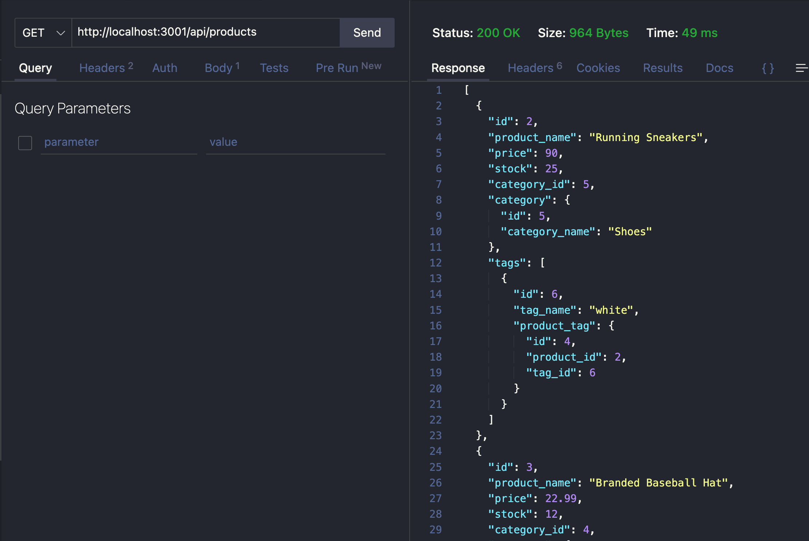

# E-Commerce-Backend

## Table of Contents

- [General Info](#general-information)
- [Features](#features)
- [Installation](#installation)
- [Screenshot](#screenshot)
- [Video Demonstration](#video-demonstration)
- [Project Status](#project-status)
- [Acknowledgements](#acknowledgements)

## General Information

-This is a backend application that allows you to create, edit, delete, and view database tables for Products, Tags, and Categories via POST, PUT, DELETE, and GET queries.

## Features

-This application utilizes Object Relational Mapping to mainpulate an API database via Thunderclient or similar testing applications. A MySQL database executes sql queries as users manipulate the data via their testing platform (such as Thunderclient or Insomnia). Users can view each table as a whole or by single ids, as well as update or delete by id, or create a single row in any table.

## Installation

- In order to install this program, you will need to:
    - Install the package.json dependencies
        - In the console, run "npm i"
    - Edit the .env file to reflect your local username and password
    - Create the database in your SQL manager
        - Run the schema.sql in your SQL manager
        - Seed the SQL database
            - In the console, run "npm run seed"
    - Run the server
        - In the console, run either "npm run start", or "nodemon" if you use nodemon.

## Screenshot

## Video Demonstration

> You can view a video demonstration [_here_](https://drive.google.com/file/d/1_7qiq4tlYlFgrIQMHwY1i9XO6OMCqlez/view?usp=sharing).

## Project Status

Project is: _finished_.

## Acknowledgements

- This project was created with assistance from our bootcamp instructor and student conversations. Thanks for the teamwork!
